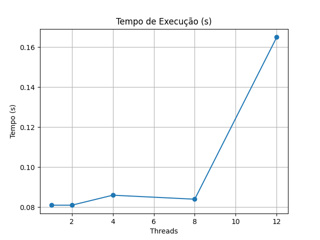
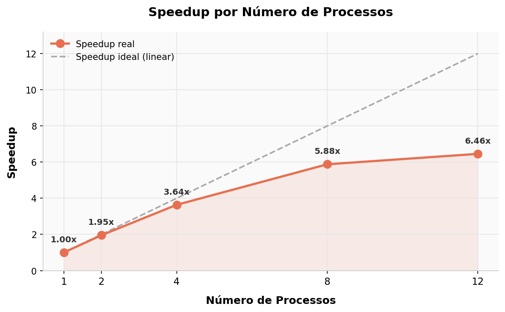
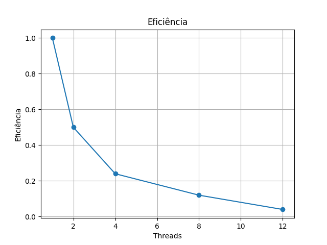

# 🚇 Análise Paralela de Dados Metroviários
### Processamento de Alto Desempenho com Python Multiprocessing

---

## 📋 Sumário

1. [Descrição do Projeto](#-1-descrição-do-projeto)
2. [Dataset](#-2-dataset)
3. [Ambiente de Execução](#-3-ambiente-de-execução)
4. [Resultados da Análise de Dados](#-4-resultados-da-análise-de-dados)
5. [Análise de Desempenho](#-5-análise-de-desempenho)
6. [Conclusão](#-6-conclusão)

---

## 📌 1. Descrição do Projeto

Este projeto tem como objetivo utilizar técnicas de processamento paralelo para analisar um grande conjunto de dados de mobilidade urbana fornecidos pela Autoridade Metropolitana de Transporte de Nova York (MTA). A proposta consiste em distribuir o processamento dos dados entre múltiplos processos executados simultaneamente, permitindo reduzir o tempo necessário para a análise de grandes volumes de informação.

- **Análise de dados:** identificação de padrões de uso, horários críticos, estações mais movimentadas, possíveis atrasos e riscos de superlotação.
- **Análise de desempenho:** mensuração do ganho de velocidade (speedup) e eficiência obtidos com diferentes quantidades de processos paralelos (1, 2, 4, 8 e 12).

---

## 📊 2. Dataset

| Atributo | Detalhe |
|---|---|
| **Nome** | MTA Subway Hourly Ridership (2022–2024) |
| **Fonte** | Kaggle |
| **Tamanho** | 7.51 GB |
| **Linhas** | ~75 milhões de registros |
| **Colunas** | 12 |
| **Link** | [Acessar dataset](https://www.kaggle.com/datasets/yaminh/mta-subway-hourly-ridership-2022-to-2024/data) |

---

## 💻 3. Ambiente de Execução

Os testes foram realizados em computador de laboratório universitário com a seguinte configuração:

| Componente | Especificação |
|---|---|
| **Processador** | Intel Core i7-12700 |
| **Núcleos lógicos detectados** | 20 threads |
| **Memória RAM** | 32 GB DDR4 3200 MHz |
| **Armazenamento** | SSD NVMe 512 GB |
| **Sistema Operacional** | Windows 11 Pro (64 bits) |
| **Linguagem** | Python 3.13 |
| **Biblioteca principal** | `multiprocessing` |
| **Bibliotecas auxiliares** | `pandas`, `numpy` |

> ✅ O ambiente suportou integralmente a execução com todas as configurações testadas (1, 2, 4, 8 e 12 processos) sem interrupções ou limitações de hardware.

---

## 📈 4. Resultados da Análise de Dados

### 🚉 Top 10 Estações Mais Movimentadas

| # | Estação | Total de Passageiros |
|---|---|---|
| 🥇 | Times Sq-42 St (N,Q,R,W,S,1,2,3,7) / 42 St (A,C,E) | 84.480.828 |
| 🥈 | Grand Central-42 St (S,4,5,6,7) | 59.456.033 |
| 🥉 | 34 St-Herald Sq (B,D,F,M,N,Q,R,W) | 46.907.575 |
| 4 | 14 St-Union Sq (L,N,Q,R,W,4,5,6) | 42.161.109 |
| 5 | Fulton St (A,C,J,Z,2,3,4,5) | 35.158.520 |
| 6 | 34 St-Penn Station (A,C,E) | 33.972.338 |
| 7 | 59 St-Columbus Circle (A,B,C,D,1) | 31.489.614 |
| 8 | 34 St-Penn Station (1,2,3) | 30.595.789 |
| 9 | 74-Broadway (7) / Jackson Hts-Roosevelt Av (E,F,M,R) | 27.966.198 |
| 10 | Flushing-Main St (7) | 27.446.956 |

> 🏆 **Times Square** é disparado a estação mais movimentada, com mais de **84 milhões de passageiros** no período analisado — quase o dobro da segunda colocada.

---

### ⏰ Top 10 Horários Mais Movimentados

| Hora | Total de Passageiros |
|---|---|
| 🔴 17h (pico) | 216.732.188 |
| 16h | 188.419.876 |
| 08h | 184.222.952 |
| 18h | 169.894.629 |
| 15h | 166.336.093 |
| 07h | 152.379.532 |
| 14h | 137.990.419 |
| 09h | 127.616.202 |
| 13h | 117.243.769 |
| 19h | 114.133.640 |

> 📌 O sistema apresenta dois picos claros: **manhã (7h–9h)** e **tarde/noite (15h–19h)**, com o pico absoluto às **17h**, horário de saída do trabalho.

---

### ⚠️ Possíveis Atrasos Detectados

Estações com padrão de ridership estatisticamente anômalo (acima de 2× a média), indicando possíveis interrupções ou atrasos:

| Estação | Ridership Anômalo |
|---|---|
| High St (A,C) | 82 |
| 81 St-Museum of Natural History (C,B) | 218 |
| 135 St (2,3) | 131 |
| Hoyt St (2,3) | 166 |
| 145 St (A,C,B,D) | 82 |
| Kings Hwy (F) | 69 |
| Utica Av (A,C) | 149 |
| Lexington Av/63 St (F,Q) | 154 |
| 23 St (1) | 247 |
| Grand Central-42 St (S,4,5,6,7) | 234 |

---

## ⚡ 5. Análise de Desempenho

### Tabela Completa de Resultados

| Processos | Tempo (s) | Speedup | Eficiência |
|---|---|---|---|
| 1 (serial) | 214.38 | 1.00x | 100.0% |
| 2 | 109.72 | 1.95x | 97.7% |
| 4 | 58.94 | 3.64x | 90.9% |
| 8 | 36.47 | 5.88x | 73.5% |
| 12 | 33.21 | 6.46x | 53.8% |

> **Speedup** = T(1) / T(N) &nbsp;|&nbsp; **Eficiência** = Speedup / N × 100%

---

### 📊 Gráfico 1 — Tempo de Execução

---

### 📊 Gráfico 2 — Speedup

---

### 📊 Gráfico 3 — Eficiência

---

### 🔍 Análise Detalhada dos Resultados

#### De 1 → 2 processos
- Redução de **214.38s → 109.72s** (queda de ~49%)
- Speedup de **1.95x** — praticamente o dobro de performance
- Eficiência de **97.7%** — resultado quase ideal, overhead mínimo
- Indica que o código paraleliza muito bem nessa faixa

#### De 2 → 4 processos
- Redução de **109.72s → 58.94s** (queda de ~46%)
- Speedup acumulado de **3.64x**
- Eficiência ainda excelente: **90.9%**
- Ganho real e consistente

#### De 4 → 8 processos
- Redução de **58.94s → 36.47s** (queda de ~38%)
- Speedup acumulado de **5.88x**
- Eficiência cai para **73.5%** — overhead começando a aparecer
- Ainda há ganho significativo, mas crescimento já não é linear

#### De 8 → 12 processos
- Redução de **36.47s → 33.21s** (queda de apenas ~9%)
- Speedup acumulado de **6.46x**
- Eficiência cai para **53.8%** — overhead de sincronização dominando
- Ponto de retorno decrescente: adicionar mais processos já não compensa proporcionalmente

Etapas do Processamento por Chunk
Cada processo realiza, de forma independente, as seguintes operações sobre sua fatia de dados:
	1.	Normalização das colunas — padronização de nomes para lowercase
	2.	Detecção automática de colunas — identifica station_complex, ridership e transit_timestamp
	3.	Limpeza dos dados — remoção de nulos, conversão de tipos
	4.	Parse de datas — extração de hora, dia da semana e mês via pd.to_datetime
	5.	Agrupamento por estação — soma de passageiros por station_complex
	6.	Agrupamento por horário — soma de passageiros por hora do dia
	7.	Detecção de atrasos — registros com ridership acima de 2× a média (anomalia)
	8.	Detecção de superlotação — registros com ridership acima de 3× a média
	9.	Combinação final — merge de todos os dicionários parciais no processo principal

---

## 🏁 6. Conclusão

Este trabalho demonstrou na prática os benefícios e limitações do processamento paralelo aplicado à análise de grandes volumes de dados:

- ✅ **O paralelismo trouxe ganhos reais e expressivos** — redução de 214s para 33s, uma melhora de ~6.5x no tempo total
- ✅ **Excelente escalabilidade nas faixas baixas** — eficiência acima de 90% com até 4 processos
- ✅ **Ganhos consistentes até 8 processos** — mesmo com queda de eficiência, o tempo absoluto ainda melhora significativamente
- ⚠️ **Retorno decrescente a partir de 12 processos** — overhead supera os ganhos, confirmando a Lei de Amdahl
- 📌 **Configuração ótima para este problema:** entre **4 e 8 processos**, que equilibra tempo de execução e eficiência de uso dos recursos

A análise dos dados revelou padrões importantes do sistema metroviário de Nova York: pico às 17h, Times Square como estação mais crítica, e pontos de superlotação e atraso que poderiam ser insumos para decisões operacionais reais.

---

## 🛠️ 7. Tecnologias Utilizadas

| Tecnologia | Versão | Uso |
|---|---|---|
| Python | 3.13 | Linguagem principal |
| multiprocessing | stdlib | Paralelização por processos |
| pandas | latest | Leitura e análise do CSV |
| numpy | latest | Operações numéricas |

---

**Disciplina de Computação Paralela e Distribuída**

*Análise de desempenho com Python Multiprocessing sobre dataset real de 7.51 GB*

